<div align="center">

# 👥 EMS Portal
### Employee Management System

Aplikasi web modern untuk mengelola data karyawan, departemen, dan laporan perusahaan — dengan dashboard terpisah untuk Admin dan Karyawan.


</div>

---

## ✨ Fitur Utama

### 🛠️ Untuk Admin
| Fitur | Deskripsi |
|---|---|
| 📊 **Dashboard** | Ringkasan total karyawan, karyawan aktif, karyawan baru, dan karyawan cuti |
| 👤 **Manajemen Karyawan** | Tambah, cari, dan filter data karyawan berdasarkan departemen, status, dan jenis kelamin |
| 🏢 **Manajemen Departemen** | Kelola daftar departemen beserta jumlah karyawan di masing-masing departemen |
| 📈 **Laporan** | Statistik karyawan per departemen, status (aktif/nonaktif/cuti), dan jenis kelamin |
| 🔄 **Impor / Ekspor Data** | Upload data karyawan lewat CSV atau unduh data dalam format CSV |
| ⚙️ **Pengaturan Akun** | Ubah profil dan password admin |

### 👤 Untuk Karyawan
| Fitur | Deskripsi |
|---|---|
| 📊 **Dashboard** | Ringkasan informasi akun dan menu cepat |
| 🔍 **Cari Rekan Kerja** | Direktori karyawan untuk mencari data rekan kerja (read-only) |
| 💰 **Slip Gaji** | Lihat slip gaji pribadi per periode (read-only) |
| 📇 **Data Diri** | Lihat data kepegawaian dan edit data pribadi (no. telepon, alamat) |
| ⚙️ **Pengaturan Akun** | Ubah profil dan password karyawan |

### 🔐 Keamanan Akses
- Login terpisah untuk **Admin** dan **Karyawan**
- Karyawan hanya bisa melihat data miliknya sendiri (read-only)
- Data kepegawaian (NIP, departemen, jabatan) hanya bisa diubah oleh Admin

---

## 📸 Tampilan Aplikasi

<details open>
<summary><b>🔑 Autentikasi</b></summary>
<br>

**Login**
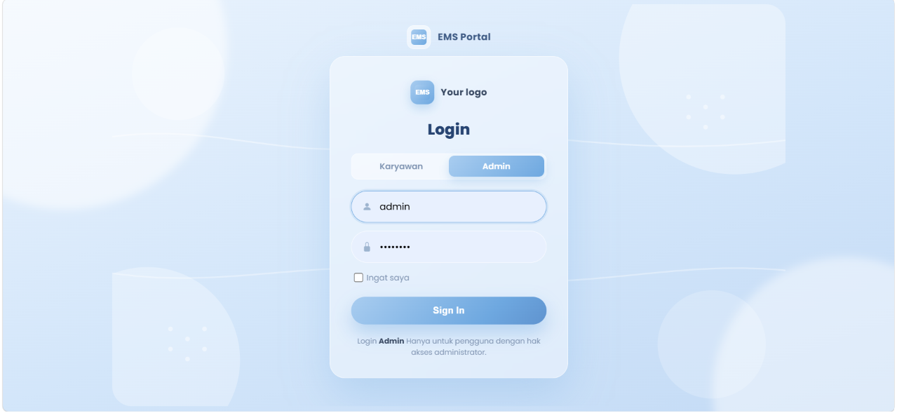

</details>

<details open>
<summary><b>🛠️ Panel Admin</b></summary>
<br>

**Dashboard**
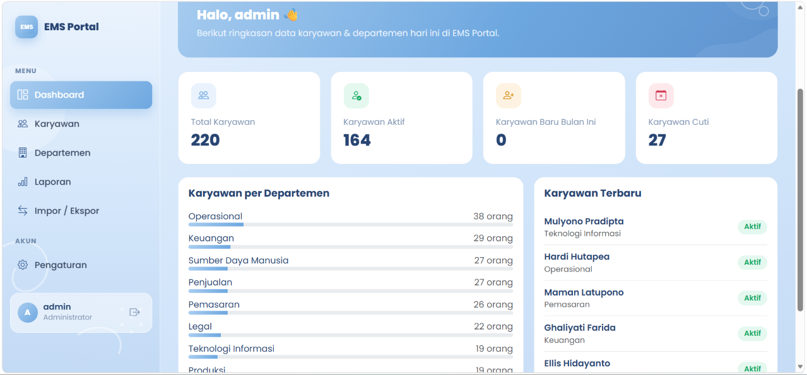

**Data Karyawan**
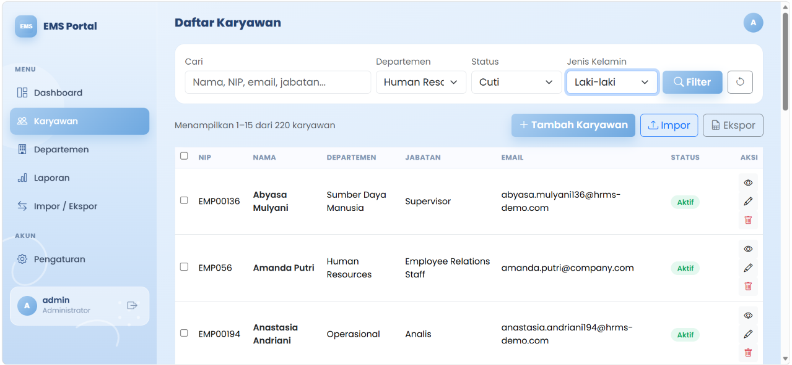

**Departemen**
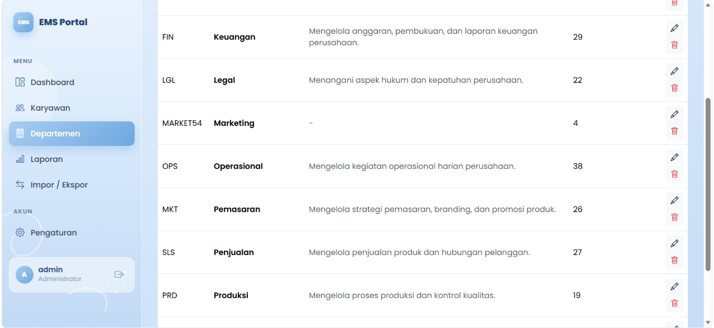

**Laporan**
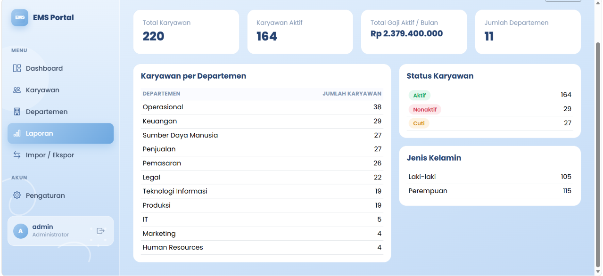

**Impor / Ekspor**
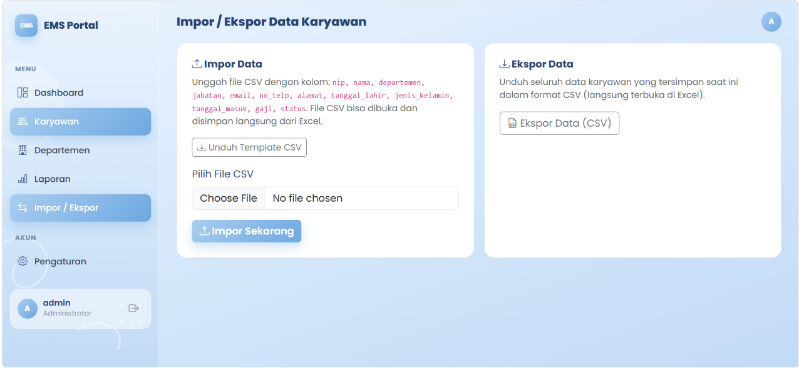

**Pengaturan Akun**
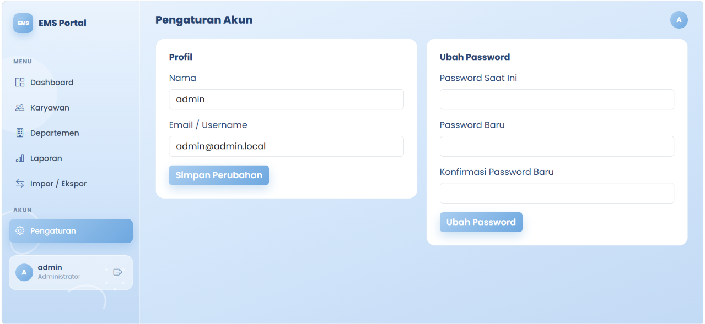

</details>

<details open>
<summary><b>👤 Panel Karyawan</b></summary>
<br>

**Dashboard**
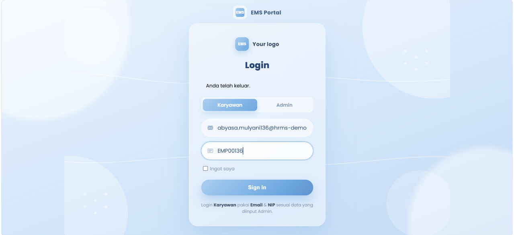

**Cari Rekan Kerja**
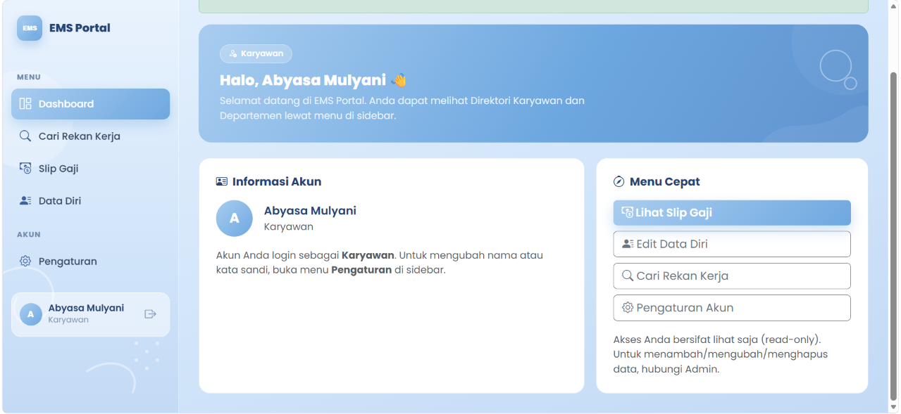

**Slip Gaji**
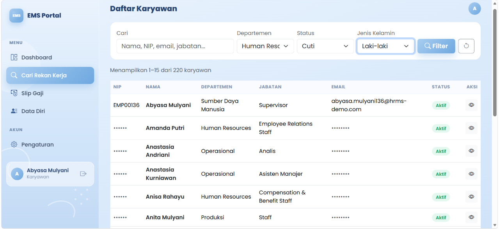

**Data Diri**
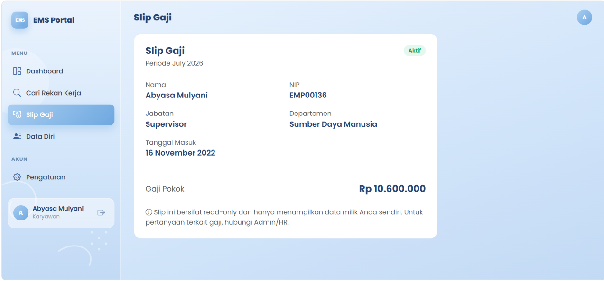

**Pengaturan Akun**
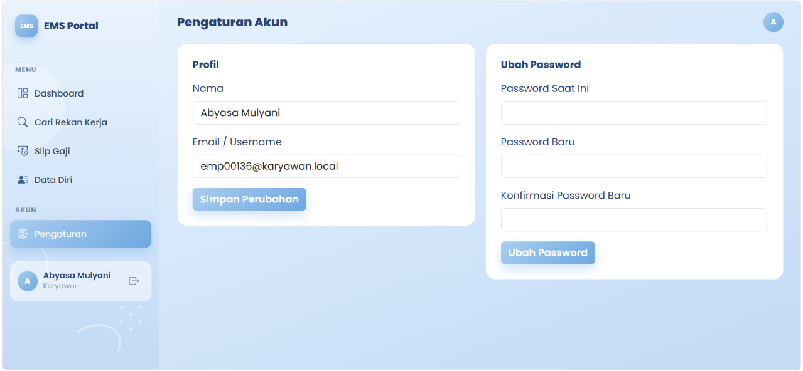

</details>

---

## 🛠️ Tech Stack

- **Backend:** Laravel 12 (PHP 8.2)
- **Frontend:** Tailwind CSS 4, Vite 7
- **Database:** MySQL

---

## 🚀 Instalasi

```bash
# Clone repository
git clone https://github.com/salwaindriyani91-cpu/employee-management-system.git
cd employee-management-system

# Install dependencies
composer install
npm install

# Setup environment
cp .env.example .env
php artisan key:generate

# Migrasi database
php artisan migrate

# Jalankan aplikasi
composer run dev
```

---

## 👩‍💻 Author

Dibuat dengan 💙 oleh **Salwa Indriyani**

[](https://github.com/salwaindriyani91-cpu)

<div align="center">

⭐ Jangan lupa kasih star kalau project ini bermanfaat!

</div>
